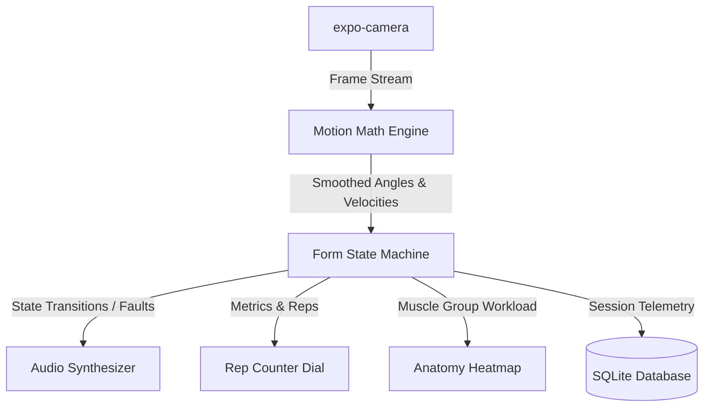

# Aura Fitness - Smart Form Coach & Biomechanical Telemetry Pipeline

Aura Fitness is a premium, real-time AI-powered fitness assistant and biomechanical form coach designed to track workout posture, analyze form errors, count repetitions, and provide instantaneous voice feedback. Using computer vision pose tracking and biomechanical math, Aura Fitness acts as a personal trainer in your pocket.

---

## 🚀 Key Features

- **Real-Time Pose Estimation & Tracking**: Integrated camera view with live keypoint overlays using high-frequency pose landmarks.
- **Biomechanical Motion Engine**: Smart motion analysis with joint-angle smoothing (using Savitzky-Golay filtering concepts) to accurately evaluate movement velocity and trajectories.
- **Form State Machine**: A robust finite state machine (FSM) designed to handle exercise tracking (e.g., Squat depth, eccentric/concentric phase transitions, and tempo validation).
- **Anatomy Heatmap**: Dynamic SVG-based anterior and posterior mind-muscle map that visually indicates muscle activation levels using HSL-based color gradients.
- **Instant Audio Feedback**: Interactive speech and chime synthesizer utilizing native text-to-speech engines to correct form in real time (e.g., "Go deeper", "Slow down").
- **Offline Telemetry Storage**: Local sqlite database for high-fidelity logs, rep histories, joint angle timeseries, and performance metrics.

---

## 🛠️ Tech Stack & Architecture

Aura Fitness is built using a modern, multi-platform mobile architecture:

- **Core Framework**: React Native & Expo (v54.0.0) with TypeScript.
- **Video & Camera**: `expo-camera` and `expo-av` for device camera access.
- **Speech Engine**: `expo-speech` for real-time auditory trainer commands.
- **Local Storage**: `expo-sqlite` for secure, low-latency telemetry storage.
- **Styling**: Vanilla React Native StyleSheet with custom dark/neon accents (`#0A0E17`, `#39FF14`, `#FF3131`).

### System Overview Diagram



---

## 📁 Project Structure

```text
aura-fitness/
├── src/
│   ├── components/            # Interactive UI & Visualization Components
│   │   ├── AnatomyHeatmap.tsx         # Muscle activation map (Anterior/Posterior)
│   │   ├── CameraPoseTrackerView.tsx  # Camera stream with skeleton overlays
│   │   └── RepCounterDial.tsx         # Visual progress/tempo ring indicator
│   ├── database/              # SQLite Database Schema & Queries
│   │   └── sqlite.ts                  # Local storage initializer & CRUD helpers
│   ├── engines/               # Core Processing & Calculation Engines
│   │   ├── audioSynthesizer.ts        # Vocal and chime feedback generator
│   │   ├── moduleManager.ts           # Central pipeline orchestrator
│   │   ├── motionMath.ts              # Kinematics, smoothing, and angle math
│   │   └── stateMachine.ts            # Squat phase and posture state machine
│   └── screens/               # App Screens
│       └── Dashboard.tsx              # Main tracking dashboard
├── App.tsx                    # Main App entry point
├── app.json                   # Expo App Configuration
├── package.json               # Dependencies and runner scripts
└── tsconfig.json              # TypeScript compilation setup
```

---

## 🏁 Getting Started

### Prerequisites

Ensure you have **Node.js (v18+)** and **npm** installed on your system. You will also need the **Expo Go** application on your physical iOS/Android device to test camera functionalities, or setup emulators with camera simulation.

### Installation

1. Clone the repository:
   ```bash
   git clone https://github.com/Keshavbp/Aura_Fitness.git
   cd Aura_Fitness
   ```

2. Install the dependencies:
   ```bash
   npm install
   ```

---

## 📱 Running the Application

Start the Expo Development Server:

```bash
npm run start
```

Once the dev server is running, you can:
- **Scan the QR Code** displayed in your terminal using your phone's camera (iOS) or the Expo Go app (Android).
- Press **`a`** to open in an Android Emulator.
- Press **`i`** to open in an iOS Simulator.
- Press **`w`** to launch the web version of the application in your browser.

---

## 📜 Architectural Specifications

For details on the system specifications, see the documentation files included in the project:
* [Application Flow & Navigation Specification](file:///d:/Projects/AURA%20FITNESS/Aura%20Fitness%20-%20Application%20Flow%20&%20Navigation%20Specification%20(App%20Flow).md)
* [Backend Schema & Data Sync Specification](file:///d:/Projects/AURA%20FITNESS/Aura%20Fitness%20-%20Backend%20Schema%20&%20Data%20Sync%20Specification.md)
* [Multi-Platform Product Requirements Document](file:///d:/Projects/AURA%20FITNESS/Aura%20Fitness%20-%20Multi-Platform%20Product%20Requirements%20Document%20(PRD).md)
* [Multi-Platform Technical Requirements Document](file:///d:/Projects/AURA%20FITNESS/Aura%20Fitness%20-%20Multi-Platform%20Technical%20Requirements%20Document%20(TRD).md)
* [UI UX Design Brief Specification](file:///d:/Projects/AURA%20FITNESS/Aura%20Fitness%20-%20UI%20UX%20Design%20Brief%20Specification.md)
* [Comprehensive Multi-Platform Implementation Plan](file:///d:/Projects/AURA%20FITNESS/Aura%20Fitness%20-%20Comprehensive%20Multi-Platform%20Implementation%20Plan.md)

---

## 📄 License

This project is licensed under the MIT License - see the [LICENSE](file:///d:/Projects/AURA%20FITNESS/LICENSE) file for details.
